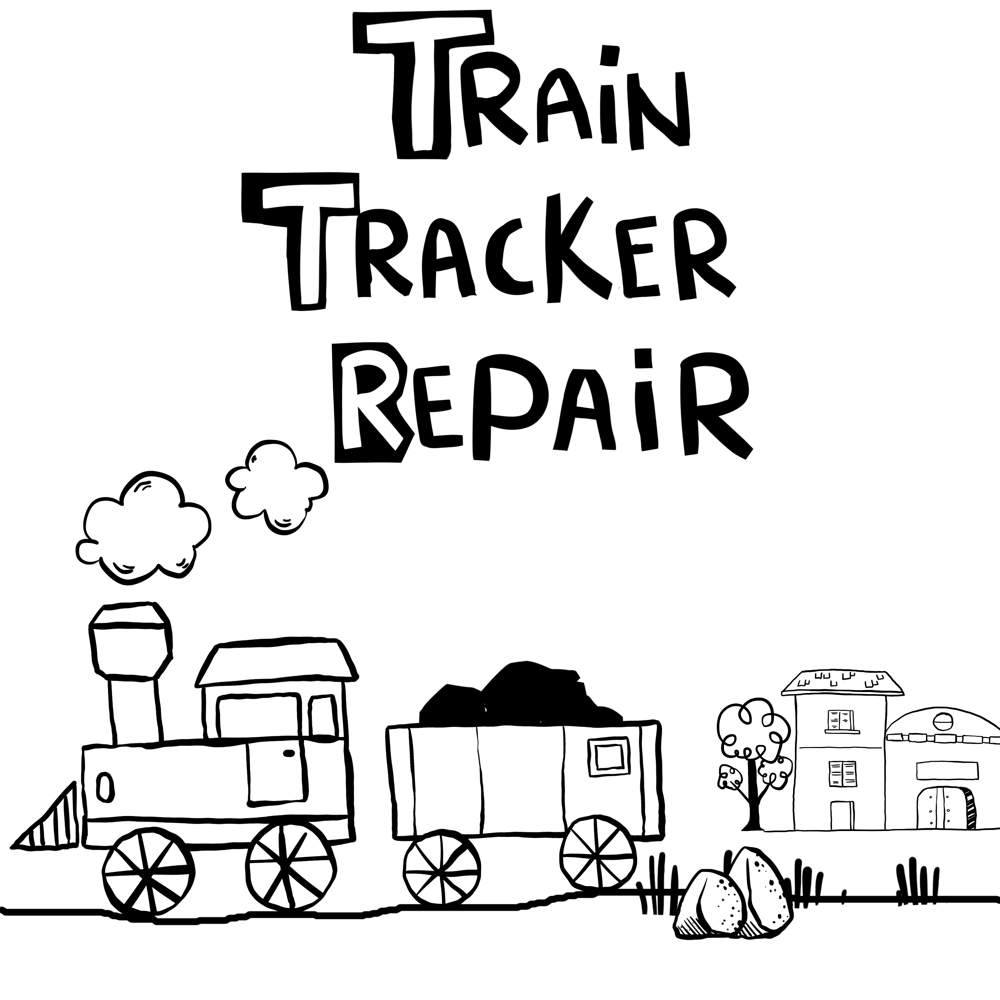
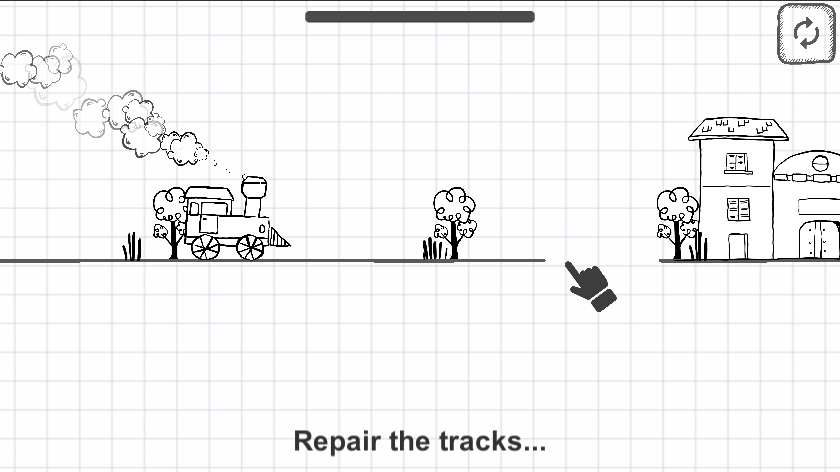
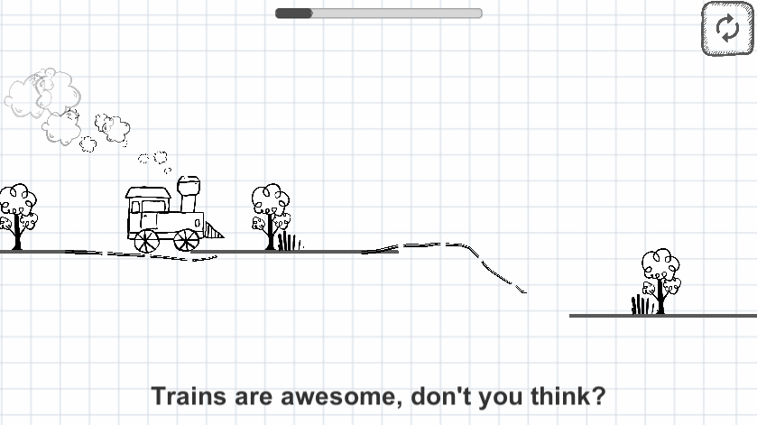

# Train_Track_Repair_GGJ2020

Train Track Repair is a game made during the [Global Game Jam 2020](https://globalgamejam.org/2020/) under the theme "Repair".

## Game logic:
In this 2D game, the player is asked to fix the tracks of the train by drawing them in a form of lines (see screenshots for a better understanding).

## Screenshots:

## Tools used:
* Visual studio (IDE)
* C# (logic)
* Unity (game engine)
* Inkscape (Image editting)

## Team:
This project was made by: 
* [Aimene Bahri](https://github.com/Aimene-BAHRI)
* [Zakaria Bonnor](https://github.com/ZakiBonnor)
* [Oussama Bonnor](https://github.com/oussamabonnor1)
* Special thanks to: [Bidou Sidahmed](https://web.facebook.com/Bidou-566411560134295/)

## Contribution:
Feel free to `fork` this project and add whatever you like. If you have any suggestions or any comments please feel free to contact me or to open an issue, use free license art assets please.
